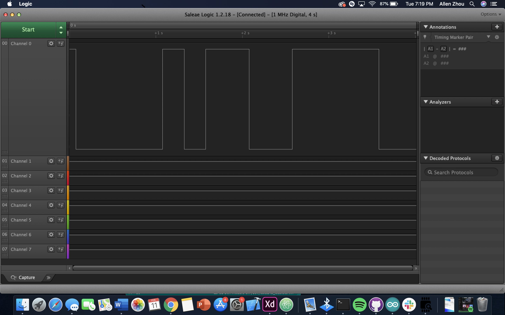

Name: Allen Zhou    

EID: axz82

Team Number: 11

## Questions

1. Why does your program need a setup and a loop?

Setup is for initializing values while the loop does the work. 

2. What is the downside to putting all your code in a loop?

It won't be readable as you won't have methods that organize your code. Also, you can't call functions.

3. Why does your code need to be compiled?

You have to transform your code from high level language to low level machine code.

4. When lowering the frequency in procedure A, step 4, what is going wrong? Brainstorm some solutions. Dimmers exist in the real world. What is their solution?

    The LED starts flashing

5. Why do you need to connect the logic analyzer ground to the ESP32 ground?

This creates a closed circuit.

6. What is the difference between synchronous and asynchronous communication?

Synchronous communication happens when both sides communicate at the same time. Asynchronous allows for delays and awaiting communication. Basically, the receipients don't have to respond immediately in the latter form of communication. 

7. Profile of UART: Sent X bytes in Y time 

4 bytes in .327 ms

8. Profile of SPI: Sent X bytes in Y time

4 bytes in .147

9. Why is SPI so much faster than UART?

SPI employs synchronous communication which is much faster than UART's asychronous communication. That's because messages can be sent in blocks instead of as individual bytes. 

10. list one pro and one con of UART

Pro: asychronous programming makes it so that receipients of communication don't have to respond immediately. Con: slower than sychronous because there is overhead required to maintain asynchrony.

11. list one pro and one con of SPI

Pro: speed. Sometimes, SPI can be 3 times as fast as UART due to its sychronous nature. However, the communication must be well defined and planned in advace. There is less flexibility. 

12. list one pro and one con of I2C

Pro: requires only two wires to transmit data. The tradeoff for this simplicity is that SPI is faster.

13. Why does I2C need external resistors to work?

To restore signal high. It provides a default state for the wire. 

## Screenshots

Procedure A, step 1:

Procedure A, step 4:

Procedure B, UART:

Procedure B, SPI:

